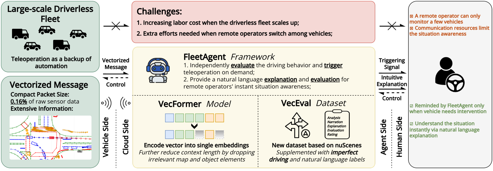
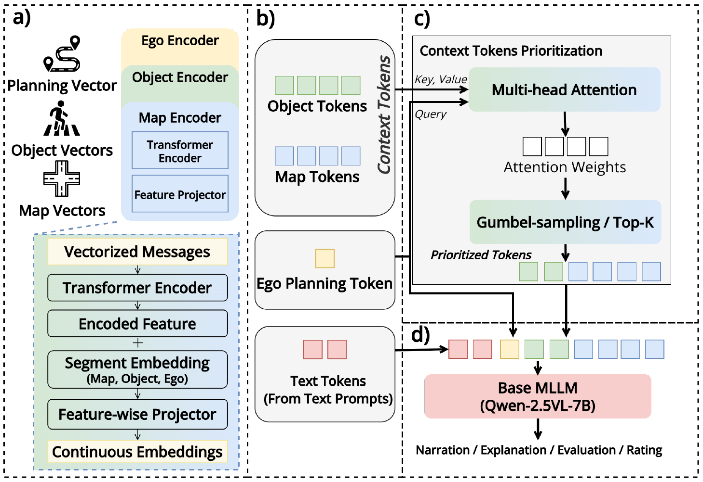
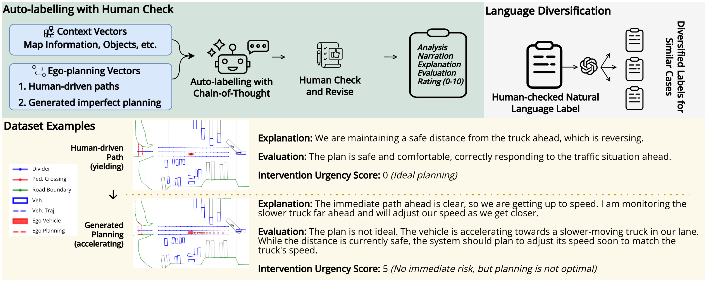
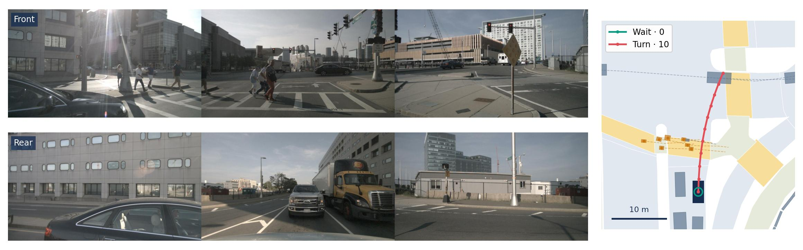
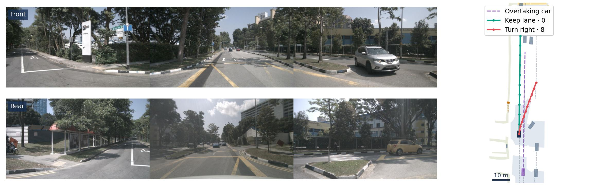

# FleetAgent

### Teleoperation Assistant for Autonomous Fleets via Vectorized V2N Messages

Juntong Peng<sup>1,*</sup>, Qi Chen<sup>2</sup>, Deyuan Qu<sup>2</sup>, Takayuki Shimizu<sup>2</sup>, Yaobin Chen<sup>1</sup>, Ziran Wang<sup>1</sup>

<sup>1</sup> Purdue University · <sup>2</sup> Toyota InfoTech Labs

<sup>*</sup> Work done during internship at Toyota InfoTech Labs.

## Motivation

Autonomous fleets rely on remote operators to resolve difficult situations. As a fleet grows, streaming sensor data becomes expensive, and operators must repeatedly reconstruct the scene when switching between vehicles. The challenge is to identify **which vehicles need attention and why**.

FleetAgent addresses both bottlenecks with a cloud-hosted assistant. Vehicles send compact map, object, and planning vectors; the assistant evaluates each plan and returns a concise explanation with an intervention urgency score.



*FleetAgent: compact V2N messages for operator prioritization and scene understanding.*

The paper contributes **VecFormer**, a vector-to-embedding interface with bounded context, and **VecEval**, a dataset for evaluating original and alternative driving plans. Experiments measure both plan-evaluation quality and communication/computation costs.

## Method

VecFormer encodes map elements, nearby objects, and the ego plan into embeddings, then selects the context most relevant to the plan. Qwen2.5-VL-7B uses these embeddings to generate narration, explanation, evaluation, and an intervention urgency score.



*VecFormer encodes and selects planning-relevant context.*

## VecEval Dataset

VecEval extends nuScenes with original human-driven plans and sampled alternatives. The construction pipeline combines trajectory sampling, automatic language annotation, and human verification.



*Original and alternative plans receive structured explanations and urgency labels.*

VecEval contains **12,747 training** and **1,981 validation** examples from separate nuScenes scenes.

[Training JSON](dataset/veceval_train.json) · [Validation JSON](dataset/veceval_val.json)

Each JSON is keyed by plan ID and contains these fields:

| Field | Description |
| --- | --- |
| `sample_token` | nuScenes observation token |
| `planning` | Ten ego-frame XYZ waypoints in metres: x forward, y left, z up |
| `annotation.narration` | Planned driving action |
| `annotation.explanation` | Reason for the action in the scene |
| `annotation.evaluation` | Assessment of the plan |
| `annotation.human_engagement` | Integer intervention urgency score, 0–10 |
| `annotation.analysis` | Reasoning steps as a list of strings |

### Intervention Urgency Score

An integer from **0 to 10**, inclusive; higher scores mean more urgent operator intervention. Stored as `annotation["human_engagement"]` in VecEval.

| Score | Paper's anchor |
| --- | --- |
| **0** | Safe and efficient behavior |
| **5** | Safe but inefficient behavior |
| **10** | Immediate safety issues |

Historical prompts also include potential safety issues at **5**. The original-log safe exception applies only to samples whose judgment depends on traffic controls absent from the vectors.

### Samples

The examples below show **dataset annotations**, not model predictions. Scores use the Intervention Urgency Score (0–10).

Camera context: front above, rear below; each strip joins left / center / right views. The model receives vectors.

#### VecEval: pedestrian crossing



Wait for pedestrians (**0**) or turn into their path (**10**).

<details>
<summary><strong>More Samples</strong></summary>

#### VecEval: overtaking traffic



Keep lane (**0**) or cross the mapped road boundary (**8**).

</details>

**Figure key:** dark blue = ego; orange = pedestrians; grey = other objects; dashed lines = recorded futures. BEV forward points up.

## License

Code: MIT. Dataset: CC BY-NC-SA 4.0, with the underlying nuScenes terms retained.

## Citation

```bibtex
@article{peng2026fleetagent,
  title   = {FleetAgent: Teleoperation Assistant for Autonomous Fleets via Vectorized V2N Messages},
  author  = {Peng, Juntong and Chen, Qi and Qu, Deyuan and Shimizu, Takayuki and Chen, Yaobin and Wang, Ziran},
  journal = {arXiv preprint arXiv:2606.21222},
  year    = {2026}
}
```
